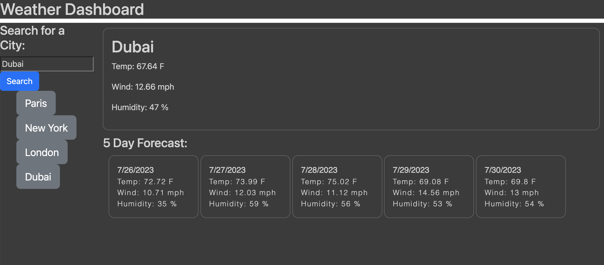

# 06 Server-Side APIs: Weather Dashboard

## Description

This web application leverages the OpenWeather API to return the current weather and the 5 day forecast for any city. It was structured using html, designed with bootstrap and CSS, and operates with Javascript and JQuery. It also leverages local storage to store the user's previous searches. Its very useful for a quick overview of the weather!

## Table of Contents

-   [Installation](#installation)
-   [Usage](#usage)
-   [Credits](#credits)
-   [License](#license)

## Installation

To install the project, download the files from my Github repository here: https://github.com/sophiawilliams16/weather-forecast

and open the project in VS Code.

## Usage

To visit the live site, click here: https://sophiawilliams16.github.io/weather-forecast/

Enter a city of your choice into the search bar and press search to see the current weather and five day forecast. Your previous searches will save to local storage and remain as a button underneath the search bar for future use.

## Credits

1. OpenWeather API https://openweathermap.org/
2. Input area https://www.w3schools.com/html/html_form_input_types.asp
3. DayJs() https://mirzaleka.medium.com/the-complete-guide-to-day-js-fb835a5d945a
4. Bootstrap https://getbootstrap.com/docs/4.0/components/buttons/

## Licenses

MIT License

Copyright (c) 2023 Sophia Williams

Permission is hereby granted, free of charge, to any person obtaining a copy
of this software and associated documentation files (the "Software"), to deal
in the Software without restriction, including without limitation the rights
to use, copy, modify, merge, publish, distribute, sublicense, and/or sell
copies of the Software, and to permit persons to whom the Software is
furnished to do so, subject to the following conditions:

The above copyright notice and this permission notice shall be included in all
copies or substantial portions of the Software.

THE SOFTWARE IS PROVIDED "AS IS", WITHOUT WARRANTY OF ANY KIND, EXPRESS OR
IMPLIED, INCLUDING BUT NOT LIMITED TO THE WARRANTIES OF MERCHANTABILITY,
FITNESS FOR A PARTICULAR PURPOSE AND NONINFRINGEMENT. IN NO EVENT SHALL THE
AUTHORS OR COPYRIGHT HOLDERS BE LIABLE FOR ANY CLAIM, DAMAGES OR OTHER
LIABILITY, WHETHER IN AN ACTION OF CONTRACT, TORT OR OTHERWISE, ARISING FROM,
OUT OF OR IN CONNECTION WITH THE SOFTWARE OR THE USE OR OTHER DEALINGS IN THE
SOFTWARE.
